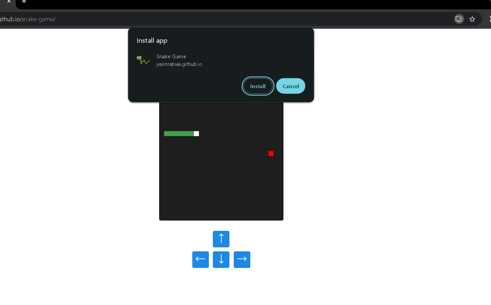

# How to make pwa

#### In this tutorial, we are going to discuss how to build a web application. Today, web applications play an important role in the web, because web applications can easily run on any hardware and software platform. stay with me...

## 1. Choose two icons

### At first you must choose your app icon.

### It's better that you choose two icon in these sizes:

### 144x144 and 512x512

## 2. Make serviceWorker.js file

### Link all project files that you need

```js
var cacheName = "v1:static";

self.addEventListener("install", function (e) {
  e.waitUntil(
    caches.open(cacheName).then(function (cache) {
      return cache
        .addAll([
          // you just need change this part
          // for example: i linked these files
          "./themes/default/css/bootstrap.min.css",
          "./themes/default/css/style.css",
          "./themes/default/fonts/Samim.woff",
          "./themes/default/fonts/Samim-Bold.woff",
          "./themes/default/js/bootstrap.min.js",
          "./themes/default/js/scripts.js",
        ])
        .then(function () {
          self.skipWaiting();
        });
    })
  );
});

self.addEventListener("fetch", function (event) {
  event.respondWith(
    caches.match(event.request).then(function (response) {
      if (response) {
        return response;
      }
      return fetch(event.request);
    })
  );
});
```

## 3. Make manifest.json file

```json
{
  "name": "Your project name",
  "short_name": "Your project name",
  // note: URL must has a https!
  "start_url": "Your website URL",
  "scope": "Your website URL",
  "display": "standalone",
  "background_color": "rgb(44, 62, 80)",
  "theme_color": "rgb(44, 62, 80)",
  "orientation": "any",
  "icons": [
    {
      "src": "icon src",
      "type": "image/png",
      "sizes": "144x144",
      "purpose": "any"
    },
    {
      "src": "icon src",
      "type": "image/png",
      "sizes": "512x512",
      "purpose": "any"
    },
    {
      "src": "icon src",
      "type": "image/png",
      "sizes": "512x512",
      "purpose": "maskable"
    }
  ]
}
```

## 4. Put these code between head tag in main page

```html
<meta name="viewport" content="width=device-width, initial-scale=1.0" />
<meta name="mobile-web-app-capable" content="yes" />
<meta name="apple-mobile-web-app-capable" content="yes" />
<meta name="apple-mobile-web-app-status-bar-style" content="black" />
<meta name="apple-mobile-web-app-title" content="Zekra" />
<meta name="theme-color" content="#3498db" />

<!--link manifest.json file-->
<link rel="manifest" href="manifest.json" />
<!--link your icons that linked in manifest.json-->
<link rel="icon" href="zekra.png" />
<link rel="apple-touch-icon" href="zekra.png" />
```

## 5. Loading ServiceWorker:

### Put these code between head tag in main page

```js
//Service Worker
if ("serviceWorker" in navigator) {
  navigator.serviceWorker
    .register("ServiceWorker.js")
    .then(function (registration) {
      console.log("success load");
    })
    .catch(function (err) {
      console.log(err);
    });
}
```

## Now, your web app is ready!


